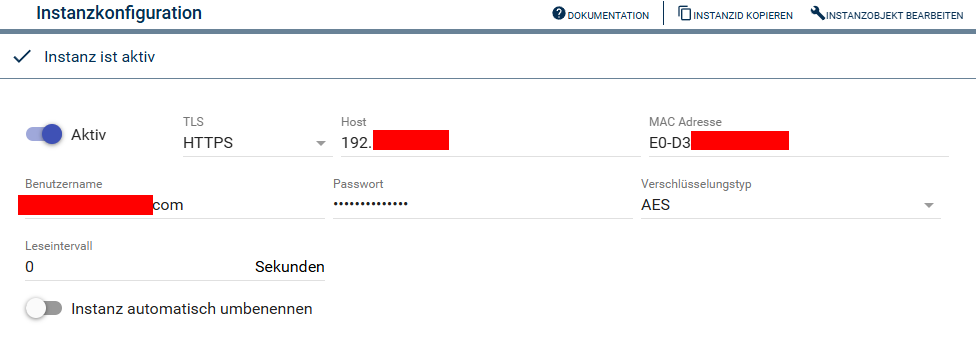

[](https://www.symcon.de/service/dokumentation/entwicklerbereich/sdk-tools/sdk-php/)
[](https://community.symcon.de/t/modul-tp-link-tapo-smarthome/131865)
[](https://www.symcon.de/de/service/dokumentation/installation/migrationen/v64-v70-q4-2023/)  [](https://creativecommons.org/licenses/by-nc-sa/4.0/)
[](https://github.com/Nall-chan/tapo-SmartHome/actions)
[](https://github.com/Nall-chan/tapo-SmartHome/actions)  
[](#2-spenden)
[](#2-spenden)  
# tapo Light Color <!-- omit in toc -->

## Inhaltsverzeichnis <!-- omit in toc -->

- [1. Funktionsumfang](#1-funktionsumfang)
- [2. Voraussetzungen](#2-voraussetzungen)
- [3. Software-Installation](#3-software-installation)
- [4. Einrichten der Instanzen in IP-Symcon](#4-einrichten-der-instanzen-in-ip-symcon)
- [5. Statusvariablen und Profile](#5-statusvariablen-und-profile)
  - [Statusvariablen](#statusvariablen)
  - [Profile](#profile)
- [6. PHP-Befehlsreferenz](#6-php-befehlsreferenz)
- [7. Aktionen](#7-aktionen)
- [8. Anhang](#8-anhang)
  - [1. Changelog](#1-changelog)
  - [2. Spenden](#2-spenden)
- [9. Lizenz](#9-lizenz)


## 1. Funktionsumfang

 - Instanz für Lampen und LED-Stripes mir Farbe  
 
## 2. Voraussetzungen

- IP-Symcon ab Version 7.0 

## 3. Software-Installation

* Dieses Modul ist Bestandteil der [tapo SmartHome-Library](../README.md#3-software-installation).  
  
## 4. Einrichten der Instanzen in IP-Symcon

Eine einfache Einrichtung ist die [Discovery-Instanz](../Tapo%20Discovery/README.md) möglich.  

Bei der manuellen Einrichtung ist das Modul im Dialog `Instanz hinzufügen` unter den Hersteller `TP-Link` zu finden.  
  

Damit Symcon mit den Geräten kommunizieren können, müssen diese in der TP-Link Cloud angemeldet und registriert sein.  
Die entsprechenden Cloud-Zugangsdaten, die MAC-Adresse und das genutzte Protokoll werden beim anlegen durch die [Discovery-Instanz](../Tapo%20Discovery/README.md) automatisch eingetragen.

 ### Konfigurationsseite <!-- omit in toc -->

  

**Benutzername und Passwort sind die Cloud/App Zugangsdaten!**  

| Name       | Text                           | Beschreibung                                                           |
| ---------- | ------------------------------ | ---------------------------------------------------------------------- |
| Open       | Aktiv                          | Verbindung zu Gerät herstellen                                         |
| Host       | Host                           | Adresse des Gerätes                                                    |
| Mac        | MAC Adresse                    | MAC Adresse des Gerätes (benötigt die Discovery-Instanz zur Zuordnung) |
| Protocol   | Protokoll                      | Genutztes Kommunikationsprotokoll (AES oder KLAP)                      |
| Username   | Benutzername                   | Benutzername für die Anmeldung (TP-Cloud Benutzername: eMail-Adresse)  |
| Password   | Passwort                       | Passwort für die Anmeldung (TP-Cloud Passwort)                         |
| Interval   | Leseintervall                  | Intervall der Abfrage von Status und Energiewerten (in Sekunden)       |
| AutoRename | Instanz automatisch umbenennen | Instanz erhält den Namen, welcher in der App vergeben wurde            |

## 5. Statusvariablen und Profile

Die Statusvariablen werden automatisch angelegt. Das Löschen einzelner kann zu Fehlfunktionen führen.

### Statusvariablen
| Ident      | Name           | Typ     |
| ---------- | -------------- | ------- |
| device_on  | Status         | boolean |
| rssi       | Rssi           | integer |
| overheated | Überhitzt      | boolean |
| brightness | Helligkeit     | integer |
| color_temp | Farbtemperatur | integer |
| color_rgb  | Farbe          | integer |


### Profile
| Name            | Typ     | genutzt von |
| --------------- | ------- | ----------- |
| Tapo.ColorTemp  | integer | color_temp  |
| Tapo.Brightness | integer | brightness  |

## 6. PHP-Befehlsreferenz

``` php
boolean TAPOSH_RequestState(integer $InstanzID);
```
---  
``` php
array|false TAPOSH_GetDeviceInfo(integer $InstanzID);
```

## 7. Aktionen

Es gibt keine speziellen Aktionen für dieses Modul.  

## 8. Anhang

### 1. Changelog

[Changelog der Library](../README.md#1-changelog)

### 2. Spenden

  Die Library ist für die nicht kommerzielle Nutzung kostenlos, Schenkungen als Unterstützung für den Autor werden hier akzeptiert:  

<a href="https://www.paypal.com/donate?hosted_button_id=G2SLW2MEMQZH2" target="_blank"></a>

[](https://www.amazon.de/hz/wishlist/ls/YU4AI9AQT9F?ref_=wl_share) 


## 9. Lizenz

  IPS-Modul:  
  [CC BY-NC-SA 4.0](https://creativecommons.org/licenses/by-nc-sa/4.0/)  
  